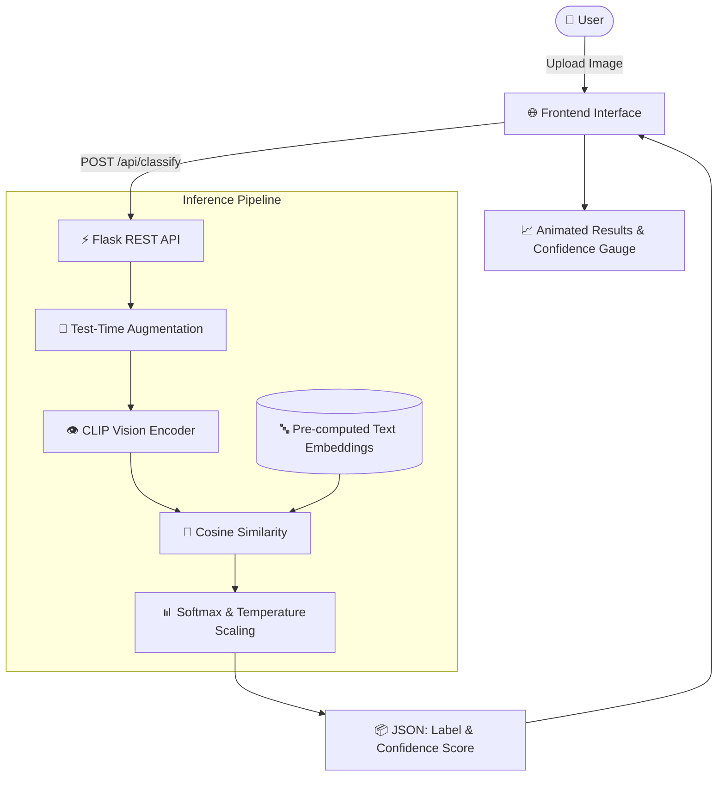

# 🔍 AI Image Detector

<div align="center">


**A modern, high-accuracy web application that detects whether an image is AI-generated (Midjourney, DALL-E, Stable Diffusion, etc.) or a real authentic photograph.**

[Features](#-key-features) • [Quick Start](#-quick-start) • [How It Works](#-how-it-works) • [API Reference](#-api-reference) • [Project Structure](#-project-structure)

</div>

---

## ✨ Key Features

- **🎯 High Detection Accuracy**: Powered by **OpenAI CLIP (ViT-B/32)** vision-language model with zero-shot semantic analysis.
- **🛡️ Prompt Ensembling**: Employs 20 curated prompts (10 AI-specific + 10 Real-specific) to build robust class representations.
- **🔄 Test-Time Augmentation (TTA)**: Evaluates multiple image orientations (original + horizontal mirror) to ensure stable and resilient predictions.
- **✨ Premium Dark Glassmorphism UI**: Built with pure CSS modern design tokens, backdrop filters, ambient glow gradients, and micro-animations.
- **📊 Animated Confidence Gauge**: Real-time SVG circular gauge showing confidence percentages (0–100%) and side-by-side score breakdown.
- **⚡ Fast Inference**: Optimized CPU/CUDA execution providing results in ~100–150ms.
- **🚀 One-Click Windows Launcher**: Includes `start.bat` for instant dependency installation and browser launch.

---

## 🏗️ Architecture



---

## 🚀 Quick Start

### Prerequisites
- **Python 3.10 or newer** ([Download Python](https://www.python.org/downloads/))
- **Git** (optional, to clone the repo)

### 1. Clone the Repository
```bash
git clone https://github.com/your-username/ai-image-classifier.git
cd ai-image-classifier
```

### 2. Windows (One-Click Launch)
Simply double-click the **`start.bat`** file in the project folder. It will:
1. Verify Python installation
2. Install all required dependencies
3. Launch the server and automatically open **`http://localhost:5000`** in your browser.

---

### 3. Manual Installation (Windows / macOS / Linux)

#### Install Dependencies
```bash
# Optional: create a virtual environment
python -m venv venv
# On Windows:
venv\Scripts\activate
# On macOS/Linux:
source venv/bin/activate

# Install requirements
pip install -r requirements.txt
```

#### Run the Application
```bash
python -m backend.app
```
Open your browser and navigate to **`http://localhost:5000`**.

---

## 🧠 How It Works

Traditional classifiers trained on small datasets quickly overfit and fail on newer image generators (Flux, SDXL, Midjourney v6). This project uses a **multi-stage vision-language approach**:

1. **Pre-trained Multimodal Representation**: Uses OpenAI's **Contrastive Language-Image Pre-training (CLIP)** trained on 400M diverse internet image-text pairs.
2. **Class Centroid Ensembling**: Instead of a single text query, the model averages embeddings across 10 specialized prompt variants for both AI synthesis cues and real photographic attributes.
3. **Logit Temperature Scaling**: Uses learned scale parameters to map cosine similarities into calibrated probability distributions.
4. **Augmented Evaluation**: Runs dual-pass inference across geometric transforms to eliminate orientation-specific artifacts.

---

## 📡 API Reference

### `POST /api/classify`

Classifies an uploaded image file.

#### Request
- **Method:** `POST`
- **Content-Type:** `multipart/form-data`
- **Body:**
  - `image`: Image binary file (`.jpg`, `.jpeg`, `.png`, `.webp`, `.bmp`, `.gif`, `.tiff`)

#### Example with cURL:
```bash
curl -X POST -F "image=@sample.jpg" http://localhost:5000/api/classify
```

#### Response (`200 OK`):
```json
{
  "label": "AI-Generated",
  "confidence": 90.8,
  "ai_score": 90.8,
  "real_score": 9.2
}
```

---

## 🌐 Public Cloud Deployment (Railway)

Deploy this app to Railway to get a **public URL** you can share with anyone:

### Step-by-Step Railway Deployment:
1. **Push to GitHub**:
   ```bash
   git init
   git add .
   git commit -m "Deploy to Railway"
   git branch -M main
   git remote add origin https://github.com/<your-username>/<your-repo-name>.git
   git push -u origin main
   ```
2. **Deploy on Railway**:
   - Go to [Railway.app](https://railway.app) and sign in with GitHub.
   - Click **New Project** → **Deploy from GitHub repo**.
   - Select your repository.
   - Railway will automatically detect [`nixpacks.toml`](nixpacks.toml) and [`Procfile`](Procfile), install PyTorch CPU, download model weights, and launch Gunicorn.
3. **Generate a Domain**:
   - In your Railway project dashboard, click on your service.
   - Go to **Settings** → **Networking** → **Generate Domain**.
   - Your public link will be live at: `https://your-app.up.railway.app`!

---

## 📁 Project Structure

```plaintext
ai-image-classifier/
├── backend/
│   ├── __init__.py
│   ├── app.py              # Flask server and API routing
│   ├── model.py            # CLIP AI model loading and inference logic
│   └── download_model.py   # Resilient model downloader with progress tracking
├── frontend/
│   ├── templates/
│   │   └── index.html      # Semantic HTML5 frontend layout
│   └── static/
│       ├── style.css       # Premium glassmorphism dark theme styling
│       └── script.js       # Client-side upload logic and gauge animations
├── tests/
│   └── test_classify.py    # Automated API integration test script
├── .gitignore              # Git ignore rules (excludes large weights, caches)
├── LICENSE                 # MIT Open-Source License
├── nixpacks.toml           # Fast build config for Railway
├── Procfile                # Production process declaration for Railway
├── README.md               # Documentation & project guide
├── requirements.txt        # Python package dependencies
├── CONTRIBUTING.md          # Contribution guidelines
├── SECURITY.md              # Security policy
└── start.bat               # Windows one-click automated setup & launcher
```

---

## 🤝 Contributing

Contributions are welcome! Please see [CONTRIBUTING.md](CONTRIBUTING.md) for details on how to submit pull requests, report issues, and suggest enhancements.

---

## 📄 License

This project is licensed under the **MIT License** — see the [LICENSE](LICENSE) file for details.

---

<div align="center">
Made with ❤️ by Kaustuv Gupta
</div>
